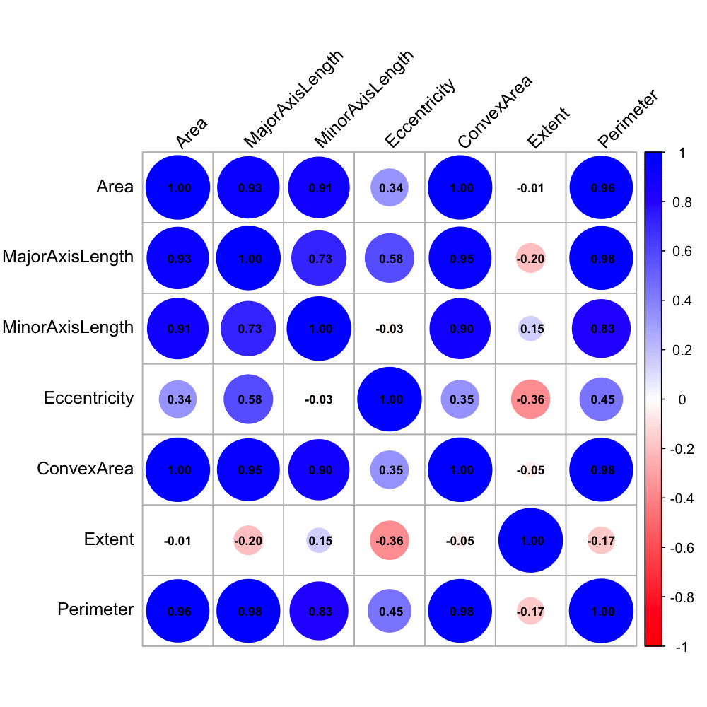

# Statistic Learning Project
> Final project for a statistical learning course, applying concepts covered during the semester. 
The goal is to classify raisins and distinguish between two different varieties of dried grapes (Kecimen and Besni) grown in Turkey, based on several physical characteristics.

#### Tables of contents
* [Path Tree](#path-tree)
* [Direct Links to Folders](#direct-links-to-folders)  
* [Running the code](#running-the-code) 
* [Overview](#overview)
* [Preview](#preview)

## Path tree
```
Real_Estate_Market_Analysis_Project /
├── Datasets/
│   └── datasets
│
├── Results/
│   ├── Data_Cleaning/                
│   ├── Prediction/    
│   ├── Raw_Graphs/
│   └── Tendance_Saison/
│
└── R code
```

## Direct links to folders
* [Agglomerative_Hierarchical_Clustering](./Agglomerative_Hierarchical_Clustering/)
* [Bonus_Models](./Bonus_Models/)
* [Model_Choice](./Model_Choice/)
* [PCA](./PCA/) 
* [Preliminary_Analysis](./Preliminary_Analysis/) 
* [ROC](./ROC/) 

## Running the code 
You must have install R, either using it directly in VS-Code, or R-Studio (better for live graphic but worst to code on)

On top of that you must install packages before using them  by making the following commmandes
```
install.packages("to_use")
library(to_use)
```
In this project, I used for different purpose the librairies just below :  
```
openxlsx
ggplot2
patchwork
cowplot
corrplot
FactoMineR
factoextra
GGally
reshape2
car
cluster
mclust
Rmixmod
alluvial
ROCR
MASS
zoo
forecast
glmnet
leaps
ggrepel
e1071
randomForest
nnet
xgboost
```


## Overview 
* Dataset on dried grapes, including measurements of their physical dimensions
* Preliminary unsupervised analysis using descriptive statistics, PCA, classification, and hierarchical clustering
* Evaluation of several supervised learning models based on various metrics (e.g., training/test error, ROC curves)
* Final focus on discriminant analysis and more advanced models not covered in class, such as Random Forests and Neural Networks
* More details in the report [See the PDF report](report.pdf)


## Preview 
here are below some of the pictures that I got : 





